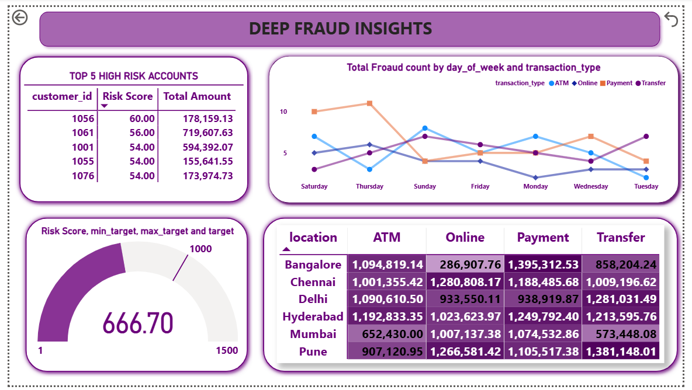
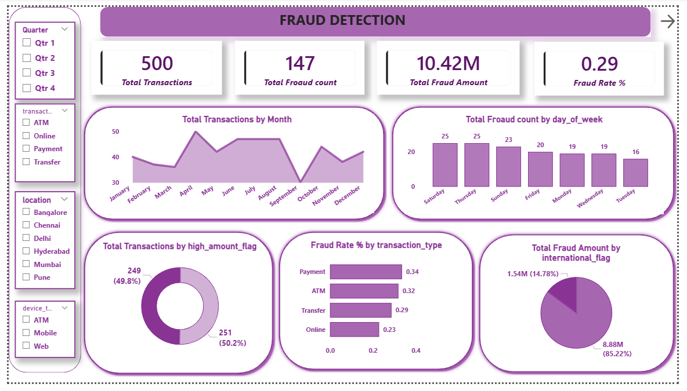
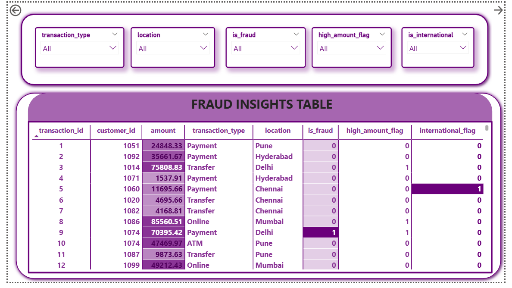

#Fraud Detection Analysis – Power BI, SQL & Python
## 1] Project Overview

Fraud detection is a critical challenge in the banking and financial services industry.
This project analyzes transaction data to identify fraudulent patterns, high-risk customers, and vulnerable transaction channels using Python, SQL, and Power BI.

An interactive 3-page Power BI dashboard was developed to help decision-makers quickly detect fraud and take preventive actions.

## 2] Project Objectives

- Identify legitimate vs fraudulent transactions

- Detect high-risk customers using risk scoring

- Analyze fraud patterns by location, transaction type, and time

- Provide actionable insights through interactive dashboards

- Support fraud analysts and business teams in fraud prevention

## 3] Dataset Overview

- Total Records: 500

- Total Columns: 13

- Type: Transactional data

### Key Fields:

- Transaction ID, Customer ID

- Transaction Amount & Time

- Transaction Type (ATM, Payment, Transfer, Online)

- Location & Device Type

- International Flag

- Fraud Indicator

The dataset used in this project is **synthetically generated** to simulate
fraud detection scenarios. It was created solely for analytical practice
and dashboard development.

## 4] Data Preparation & Feature Engineering (Python)

Data cleaning and preprocessing were performed using Python (Pandas, NumPy).

### Steps Performed:

- Removed duplicate records

- Handled missing values

- Converted data types

- Created new features:

- high_amount_flag

- international_flag

- risk_score

- Hour of transaction

- Day of week

These features helped improve fraud pattern detection.

[View Jupiter File](Fraud_detect.ipynb)

## 5] SQL Analysis

- SQL queries were used to extract key fraud insights, including:

- Top high-risk customers

- Fraud trends by day of week

- Fraud distribution by transaction type

- Total fraud loss analysis

- SQL helped validate patterns before visualization.

[View SQL File](Fraud_detection.sql)

## 6] Power BI Dashboard Overview

A 3-page interactive Power BI dashboard was created.

### Page 1: Fraud Overview

### KPIs:

- Total Transactions

- Total Fraud Count

- Total Fraud Amount

- Fraud Rate (%)

### Visuals:

- Monthly transaction trends

- Fraud by day of week

- Fraud by transaction type

- High-amount vs normal transactions

- International vs domestic fraud analysis

### Page 2: Fraud Insights Table

- Detailed transaction-level table

- Multiple filters for deep investigation:

- Transaction type

- Location

- Fraud flag

- High amount flag

- International flag

### Page 3: Deep Fraud Insights

- Fraud by day of week & transaction type

- Risk score gauge

- Heatmap of fraud amount by location & transaction type

- Top 5 high-risk customer accounts

To see Page3 : 

## 7] Key Insights & Findings

- Online and Payment transactions show the highest fraud concentration

- International transactions contribute significantly higher fraud amounts

- Metro cities such as Bangalore, Chennai, and Hyderabad show elevated fraud risk

- Fraud peaks during weekends and evening hours

- A small group of high-risk customers contributes a major portion of fraud losses

- High transaction amounts strongly correlate with fraud probability

## 8] Business Recommendations

- Strengthen authentication for Online & Payment channels (2FA, device binding)

- Monitor high-risk locations with real-time alerts

- Implement weekend-specific fraud detection rules

- Dynamically flag high-amount transactions based on customer history

- Use risk scoring to prioritize fraud investigations

## 9] Project Deliverables

- Cleaned dataset

- Python preprocessing scripts

- SQL analysis queries

- Power BI dashboard (.pbix)

- Dashboard export (.pdf)

- Project presentation (.pptx)

- Full project documentation (.pdf)

## 10] Tools & Technologies Used

- Power BI Desktop

- Python (Pandas, NumPy, Matplotlib)

- SQL

- Microsoft Excel

## 11] Conclusion

This project demonstrates how data analytics can be effectively used to detect fraud patterns and support fraud prevention strategies.
The combination of Python, SQL, and Power BI enables faster fraud identification, improved risk monitoring, and data-driven decision-making for financial institutions.

                                                                ## Author
                                                                **Ashish Jadhav**  Aspiring Data Analyst  
